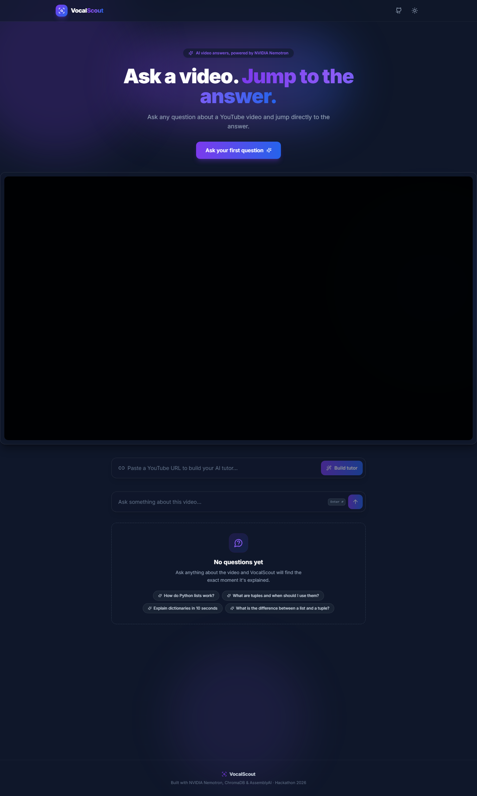

# 🎓 VocalScout

**Ask a YouTube video anything. Jump straight to the moment it's answered.**

VocalScout turns any YouTube video into an AI tutor: paste a link, it downloads the audio, transcribes it, indexes it, and lets you ask questions — each answer comes with a quote from the transcript and a **Jump to 07:59** button that seeks the embedded player to the exact moment. You can also say *"quiz me"* to get quiz questions built from the video's content.

## ✨ Features

- 🔗 **Any YouTube URL** — `watch`, `youtu.be`, `/shorts/`, `/live/`, `/embed/`, or a raw video ID
- 🏗️ **Live build progress** — download → transcribe → chunk → embed, with per-stage status
- 📜 **Clickable transcript** — searchable transcript panel beside the player, grouped by chapter, with the current chunk highlighted and every line jumping the video to its timestamp
- 💬 **Grounded answers** — the AI answers only from the video's transcript, with a supporting quote
- 🧵 **Chat with follow-ups** — the conversation carries context, so you can just ask *"why?"* or *"go deeper"* after any answer
- ⏱️ **Jump to the answer** — one click seeks the player to the answer's timestamp
- 🧠 **Adaptive explanations** — confused? Ask to "explain simply" and get a beginner-friendly breakdown
- 🧪 **Quiz mode** — "quiz me on this" generates 3 questions with answers from the transcript
- 🌗 **Light/dark mode**, animated UI, toasts, responsive layout

## 📸 Screenshot



## 🏗️ How it works

```
YouTube URL
   │
   ▼
┌──────────┐   ┌──────────────┐   ┌──────────┐   ┌──────────┐
│ yt-dlp   │──▶│ AssemblyAI   │──▶│ Chunker  │──▶│ NVIDIA   │
│ download │   │ transcribe   │   │ chapters │   │ embed +  │
│ audio    │   │ + chapters   │   │ + topics │   │ ChromaDB │
└──────────┘   └──────────────┘   └──────────┘   └──────────┘
                                                    │
   Question ──▶ hybrid search ──▶ top-3 chunks ──▶ Nemotron LLM ──▶ answer + timestamp
              (dense + BM25 RRF; optional LLM rerank, off by default)
```

**Stack:** FastAPI · ChromaDB · yt-dlp · AssemblyAI · NVIDIA NIM (Nemotron) · React 18 · Vite · Tailwind CSS · Framer Motion · react-youtube

## 📁 Project structure

```
Backend/
  main.py                  # FastAPI app: /ask /process-video /video-status /current-video
  tutor_engine.py          # Orchestrates intent → planner → RAG
  rag_service.py           # Retrieval + prompt building (answer & quiz modes)
  ingest.py                # yt-dlp download + availability probe
  agents/
    intent.py              # Rule-based intent: explain / compare / quiz / clarify
    planner.py             # Lesson-plan strategies per intent
  services/
    video_manager.py       # URL parsing, collection management
    transcriber.py         # AssemblyAI upload + polling
    chunker.py             # Transcript → chapters, then semantic topic chunks
    embeddings.py          # NVIDIA embedding API
    vector_store.py        # Chroma per-video collections
    retriever.py           # Hybrid search: dense + BM25 (RRF), optional LLM rerank
    reranker.py            # LLM relevance judge over the fused candidates
    chat.py                # NVIDIA chat completions (with retries)
  orchestrators/
    ingestion.py           # 5-step pipeline with error → status=error

Frontend/
  src/
    App.jsx                # State + wiring (build flow, polling, ask, seek)
    api.js                 # Typed API client
    components/            # VideoPlayer, TranscriptPanel, SearchBox, AnswerCard, ...
    utils/                 # formatTime, getYouTubeId

Backend/eval/
  generate_golden.py       # Regenerate eval questions from AssemblyAI chapters
  golden_set.json          # Reviewed eval questions (ground truth = chapter tags)
  run_eval.py              # 4 retrieval configs + guard threshold sweep
```

## 📊 Evaluating retrieval

The pipeline ships with its own eval harness — it scores the REAL retrieval code
(no mocks) against a hand-reviewed question set:

```bash
cd Backend && python eval/run_eval.py          # all videos, all configs
python eval/run_eval.py --video <id>           # one video (e.g. after re-ingesting it)
python eval/run_eval.py --skip-judge           # drop the judge configs (~10–22s/question saved)
```

Five configs (dense / BM25 / fusion / LLM-judge ×2) over ~79 questions report
Hit@3, MRR, Recall@20 and latency; a threshold sweep over the same questions'
cosine scores recommends `OFF_TOPIC_THRESHOLD`. Per-question rows land in
`eval/report.json`. Requires `NVIDIA_API_KEY` (embeddings + judge); the full
run takes ~25–30 minutes with the judge configs, ~3 minutes with
`--skip-judge`. To regenerate the question set: edit
`eval/generate_golden.py` and run it, then review the output as
`eval/golden_set.json`.

Latest results (2026-10-06 full rerun; 43 in-scope Docker questions):

| config | Hit@3 | MRR | Recall@20 | avg ms* |
|---|---|---|---|---|
| dense | 93.0% | 0.875 | 97.7% | ~660 |
| bm25 | 83.7% | 0.716 | 97.7% | ~650 |
| **fusion** | **95.3%** | 0.855 | 97.7% | ~660 |
| LLM judge (r1 / r2) | 95.3% / 93.0% | 0.877 / 0.868 | 97.7% | ~10,700 / ~21,700 |

\* Every config pays the same ~650ms query-embedding API call; BM25 itself is
sub-millisecond. The dense / BM25 / fusion metrics reproduced the previous run
exactly. The judge tied fusion's Hit@3 at best while costing ~10–22s more per
question — and agreed with its own repeat only 21% of the time (55% on the
Python video) — so **reranking ships off by default** (`RERANK_ENABLED=1`
re-enables it). On the re-ingested Python video, dense and fusion both hit
100% Hit@3 (BM25 90.9%). The guard sweep reconfirms
`OFF_TOPIC_THRESHOLD = 0.35`: 95% of in-scope questions score above it and 64%
of off-topic ones fall below it.


## 🚀 Getting started

### Prerequisites

- **Python 3.10+**
- **Node.js 18+**
- API keys (both have free tiers):
  - [NVIDIA NIM](https://build.nvidia.com) — chat + embeddings → `NVIDIA_API_KEY`
  - [AssemblyAI](https://www.assemblyai.com/dashboard/api-key) — transcription → `ASSEMBLYAI_API_KEY`

### 1. Get the code

```bash
git clone https://github.com/kim-t-a/vocal-scout-ai.git
cd vocalscout
```

### 2. Backend

```bash
# Create a virtual environment
python -m venv venv
source venv/bin/activate          # macOS/Linux
venv\Scripts\activate             # Windows

# Install dependencies
pip install -r requirements.txt

# Configure secrets
cp .env.example .env              # macOS/Linux
copy .env.example .env            # Windows
#   → open .env and paste your keys

# Run
cd Backend
uvicorn main:app --reload
```

The API is now at `http://127.0.0.1:8000` — interactive docs at `/docs`.

### 3. Frontend

```bash
cd Frontend
npm install
npm run dev
```

Open **http://localhost:5173**, paste a YouTube URL, hit **Build tutor**, wait for the stages to complete, then ask away.

### Frontend configuration (optional)

The frontend expects the API at `http://127.0.0.1:8000`. To point elsewhere, create `Frontend/.env`:

```
VITE_API_URL=https://your-backend-url
```

## 🔧 Environment variables

| Variable | Required | Description |
|---|---|---|
| `NVIDIA_API_KEY` | ✅ | NVIDIA NIM key for chat + embeddings |
| `ASSEMBLYAI_API_KEY` | ✅ | AssemblyAI key for transcription |
| `CORS_ORIGINS` | — | Comma-separated allowed origins. Unset = allow all (fine for local dev). **Set this in production**, e.g. `https://myapp.com` |

## 📡 API reference

| Method | Endpoint | Body / Params | Description |
|---|---|---|---|
| `POST` | `/ask` | `{"question": "...", "video_id": "..." (optional), "history": [{"role": "user"\|"assistant", "content": "..."}, ...] (optional)}` | Ask the active (or given) video a question. Quiz intent detected automatically; `history` enables follow-up questions. Responses carry a `type` field: `answer` (transcript-grounded, has timestamp + quote), `clarification` (the tutor needs more detail), `notice` (e.g. video still processing), or `error`. |
| `POST` | `/ask-stream` | Same body as `/ask` | Same answer, streamed as Server-Sent Events: `meta` (timestamp + quote) → `token` deltas → `suggestions`/`quiz`, always ended by `done`. Both endpoints share the same routing, retrieval and prompts. |
| `POST` | `/process-video` | `{"url": "https://youtu.be/..."}` | Start building a tutor for a video (background). Returns `processing` or `cached`. |
| `GET` | `/video-status/{video_id}` | — | Pipeline status: `queued / downloading / transcribing / chunking / embedding / ready / error` (+ `detail` on error) |
| `GET` | `/transcript/{video_id}` | — | Timestamped transcript chunks (`chunk_id`, `text`, `start_ms`, `end_ms`, `chapter`) for the clickable transcript panel |
| `GET` | `/current-video` | — | Server's active video |
| `GET` | `/` | — | Health check |

## ⚠️ Known limitations

- **Single-user session** — the "active video" is server-global; fine for local use, not for many simultaneous users. Per-request `video_id` support in `/ask` mitigates this.
- **In-memory status** — processing state resets when the backend restarts (restart mid-build = re-paste the URL).
- **Quizzes aren't streamed** — a quiz parses into an interactive card, so `/ask-stream` builds it in one piece and sends it whole.
- **Reranking is an LLM judge, off by default** — NVIDIA's hosted catalog no longer serves a cross-encoder reranker, so reranking means the chat model reordering the fused candidates. The eval measured it slightly *worse* than plain fusion at ~17s per question, so the live path skips it; set `RERANK_ENABLED=1` to experiment.
- **Chunks are fixed at ingestion** — chunking runs once per video. Videos ingested before the chapter/semantic chunker shipped keep their old 45s windows until they're processed again.
- **English-first** — transcription auto-detects language, but prompts/UX are English-centric.

## 🗺️ Roadmap ideas

- [x] ~~Streaming answers (SSE)~~ — shipped: `POST /ask-stream` streams the answer token by token
- [ ] Persistent job queue (e.g. Celery/Redis) + user sessions
- [x] ~~Chat history & follow-up questions~~ — shipped: the frontend sends recent turns with each `/ask`
- [x] ~~Chapter-aware chunking using AssemblyAI `auto_chapters`~~ — shipped: chapters are hard boundaries, sentence-level embeddings split inside them
- [ ] Deployment guide (Docker, Render/Railway + Vercel)

## 🤝 Contributing

Issues and PRs welcome! Keep changes minimal and consistent with the existing structure (`agents/` for AI decision logic, `services/` for external integrations, `orchestrators/` for pipelines).

## 📄 License

[MIT](LICENSE) — free to use, modify, and share.
